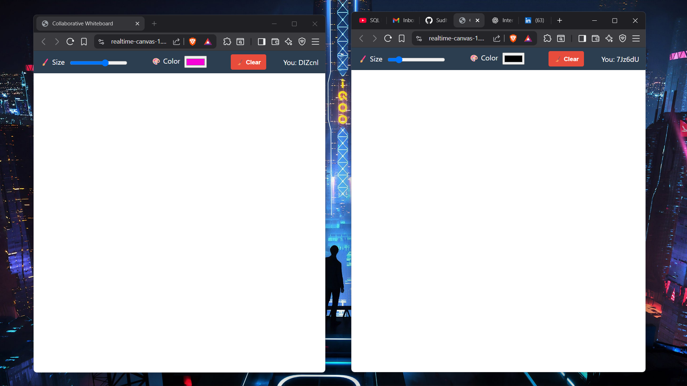
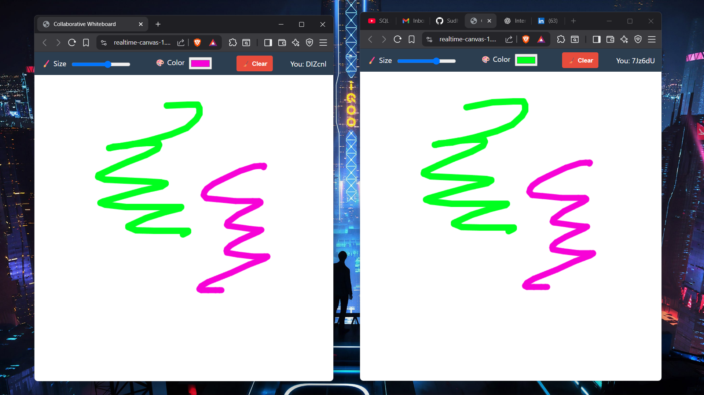

# MERN Stack Web Development  
______________________________________  
**COMPANY** : CODTECH IT SOLUTIONS  
**NAME** : SUDHIR K  
**INTERN ID** : CT08DM1071  
**DOMAIN** : MERN STACK WEB DEVELOPMENT  
**DURATION** : 8 WEEKS  
**MENTOR** : NEELA SANTOSH  

---

## 📝 Internship Work Summary
As part of my internship at CodTech IT Solutions, I developed a creative and technically engaging web application called Realtime Collaborative Canvas. The objective of this project was to implement real-time two-way communication using WebSockets and create an interactive environment where multiple users could draw on a shared canvas simultaneously. This project helped me solidify my understanding of full-duplex communication in web applications, particularly using Socket.IO with Node.js and Express.

The concept was inspired by collaborative whiteboards and creative brainstorming tools. I started the project by designing a simple and intuitive user interface using HTML5, CSS, and Vanilla JavaScript. The drawing surface was built using the HTML5 Canvas API, which allowed freeform drawing by capturing mouse and touch inputs. I implemented features such as brush size selection, color picker, and a “Clear Canvas” button that syncs with all users.

On the backend, I used Node.js and Express to create a lightweight server. I integrated Socket.IO, a WebSocket library, to manage the real-time communication between clients. When a user draws on the canvas, the application emits drawing events (coordinates, color, brush size) to the server, which then broadcasts those events to all connected clients. This ensured that everyone on the app sees the same canvas updates instantly and smoothly.

One technical challenge I faced was managing latency and synchronization when multiple users were drawing simultaneously. I optimized the data packets being sent over sockets and minimized unnecessary re-renders to keep the interface responsive. Additionally, I designed a unique user ID system to differentiate users and experimented with broadcasting and emitting events conditionally.

The Clear Canvas feature was designed to trigger a broadcast event that instructs all clients to clear their local canvases at the same time. This required coordination between client and server logic to prevent unexpected canvas resets and maintain a synchronized user experience.

To ensure responsiveness across devices, I used flexible layouts and tested the application on both desktops and mobile browsers. The canvas dynamically resizes based on the screen, and the drawing coordinates are adjusted accordingly to maintain drawing accuracy.

Finally, I deployed the full application using Render.com, a platform suitable for hosting real-time Node.js applications. The live version allows users from different devices and locations to collaboratively draw in real-time with minimal latency.

This project allowed me to gain hands-on experience in event-driven programming, WebSocket communication, and real-time UI design. I also improved my debugging skills by testing edge cases like simultaneous drawing, user disconnections, and syncing after refresh.

In summary, Realtime Collaborative Canvas was a highly rewarding project that combined creativity and technical skill. It deepened my understanding of real-time web technologies and gave me a chance to build something interactive, visually engaging, and collaborative — a perfect blend of art and engineering on the web.

---
## 📸 Demo Screenshots

### 🌤️ Home Screen of 2 users


### 🔍 Broadcasting of content for all Users


---
# 🎨 Realtime Collaborative Canvas

A real-time drawing web app using **Node.js**, **Express**, **Socket.IO**, and **HTML5 Canvas**.

Multiple users can draw on the same canvas and see each other's strokes instantly. Built for fun, collaboration, and creative expression.

---

## 🌐 Live Site

🔗 [https://realtime-canvas-1.onrender.com](https://realtime-canvas-1.onrender.com)

---

## ✨ Features

- 🖌️ Draw with customizable color and brush size  
- 👥 Real-time drawing sync between users using WebSockets  
- 🧼 Clear canvas button (syncs for all)  
- 🆔 Shows your unique user ID  
- 📱 Fully responsive layout  

---

## 🛠️ Tech Stack

- **Frontend:** HTML, CSS, JavaScript, Canvas API  
- **Backend:** Node.js, Express  
- **Realtime:** Socket.IO  
- **Hosting:** Render.com  

---

## 🚧 Local Development

```bash
# 1. Clone the repo
git clone https://github.com/SudhirKannan/realtime-canvas.git
cd realtime-canvas

# 2. Install dependencies
npm install

# 3. Start the server
node server.js
```

Made by **Sudhir**💖 
[GitHub Profile](https://github.com/SudhirKannan)
